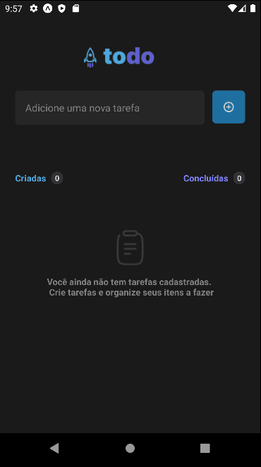

<h1 align="center">
  ToDo App
</h1>

<p align="center">
  

  

  

  

</p>

<br/>

## 💻 Project

Simple to-do list app made with React Native and TypeScript for the first Ignite course challenge. The application consists of registering a task, marking and unmarking and deleting. It also has a count of created and completed tasks.

## 🚀 Technologies

This project was developed with the main following technologies:

- [React Native](https://reactnative.dev)
- [TypeScript](https://www.typescriptlang.org/)
- [Expo](https://expo.dev/)

## 📱 Preview

<p align="center">
  
</p>

## ℹ️ How To Use

To clone and run this application, you'll need [git](https://git-scm.com) and [node](https://nodejs.org/en/). From your command line:

```bash
# Clone the repository
$ git clone https://github.com/leondavidtb/todoapp.git
```

```bash
# Go into the repository
$ cd todoapp
# Install dependencies
$ npm install
# Run the development server
$ expo start
# The app will automatically starts Metro Bundler. You may use an emulator or your own smartphone.
# The app will automatically reload if you change any of the source files.
```

---

<p align="center">Made with ☕ by Leonardo David 👋🏻 <a href="https://www.linkedin.com/in/leondavidtb/">Get in touch!</a></p>
